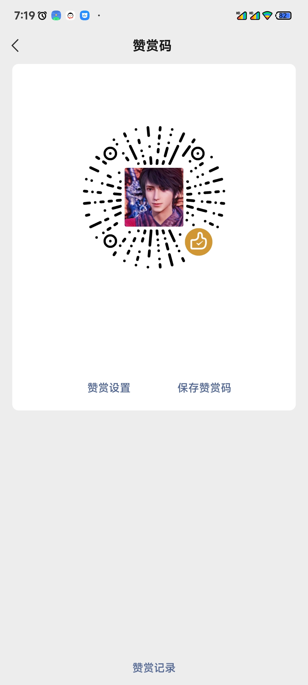

**Language**: [English.md](README_EN.md)


# 🚀 Gg_Docking_Kernel
> 使 GG 修改器对接内核驱动，实现内核级内存读取，绕过大部分内存搜索检测。
---
## 📦 支持的驱动类型
| 驱动名称 | 描述 | 特点 |
| :--- | :--- | :--- |
| `KPM-KMA-RW-DRIVER` | 内核管理器可用的内核模块 | 硬件级读取 |
| `driverGT1_567RTdev` | GT 驱动和 RT 驱动的 dev 方案 | 兼容性高 |
| `driverGT2_12RThook` | GT 驱动和 RT 驱动的 hook 方案 | 隐秘性高 |
| `driverDitNetlink_Prohook` | 巴巴托斯连理枝驱动 | 吃坤挂哥爱用 |
---
## 🛠️ 使用已编译版本
1.  进入 `Compiled_finished_product` 文件夹。
2.  找到您想使用的驱动对应的文件夹。
3.  将该文件夹内的**全部内容**移动并替换到 GG 修改器的私有目录下。
    **示例路径：**
    ```
    /data/user/0/com.apocalua.run/files/AppHidden-85uS/
    ```
> **⚠️ 注意**：每个 GG 修改器的包名不同，其私有目录的名称也可能不同。
---
## 🔨 自行编译项目
### 📋 环境准备
-   准备好 Android NDK 环境。
### 📝 编译步骤
**第一步：准备源码**
-   将项目对应驱动的源码文件夹下载并解压到一个空目录下。
-   修改 `build.sh` 文件中的 NDK 路径，将其替换为您本机的 `ndk-build` 所在目录。
    **示例：**
    ```sh
    # 将此路径
    /data/user/0/com.termux/files/home/android-ndk/ndk/29.0.14206865/ndk-build
    # 替换为你的路径，例如：
    /home/user/android-ndk/ndk/25.2.9519653/ndk-build
    ```
**第二步：进入目录**
-   使用 `cd` 命令进入源码目录。
    ```sh
    cd /path/to/your/source/folder
    ```
**第三步：执行编译**
-   运行编译脚本。
    ```sh
    ./build.sh
    ```
**最后一步：获取成果**
-   等待提示“项目编译完成”。编译产物 `libKernelGg.so` 将生成在 `build.sh` 所在目录的 `libs/arm64-v8a/` 文件夹下。
---
## 💡 实现原理
> 来源：enen 大牛的思路。
>
> 在 GG 修改器加载其原生文件读写库 `lib5.so` 之前，抢先加载一个我们准备的共享库。加载完毕后，再让 GG 加载其原始的 `lib5.so`。通过这种方式，我们能够 **Hook 系统调用号 270**，从而将 `lib5.so` 中的文件读取操作，替换为通过内核驱动进行读取的方式。
---
## 📚 NDK 安装指南
**视频教程：** [https://b23.tv/ljTKIDV](https://b23.tv/ljTKIDV)
**一键安装命令 (适用于 aarch64 架构的 Linux)：**
```sh
cd && tar -xvf android-ndk-r28c-aarch64-linux-android.tar.xz && rm -rf android-ndk-r28c-aarch64-linux-android.tar.xz && mkdir android-ndk && mkdir android-ndk/ndk && mv android-ndk-r28c 28.2.13676358 && mv 28.2.13676358 android-ndk/ndk/ && ln -s $HOME/android-ndk/ndk/28.2.13676358/toolchains/llvm/prebuilt/linux-aarch64 $HOME/android-ndk/ndk/28.2.13676358/toolchains/llvm/prebuilt/linux-x86_64 && ln -s $HOME/android-ndk/ndk/28.2.13676358/prebuilt/linux-aarch64 $HOME/android-ndk/ndk/28.2.13676358/prebuilt/linux-x86_64 && echo 'Installation Finished. Ndk has been installed successfully!'
```
---
## ⚠️ 重要注意事项
-   **内核 GT 版驱动**：需要将驱动文件解压到根目录（如 `/data/local/`），并授予 `777` 执行权限，同时将所有者和用户组设置为 `root:0`。
-   **文件权限**：替换文件后，务必将文件权限设置为 `777`，并将所有者用户组改为 GG 修改器自己的用户组。
-   **版本区别**：
    -   **96 版**：`lib5.so.primary` 文件大小约为 **3.9 MB**。
    -   **101 版**：需要在本项目的 `101version` 文件夹下找到 `lib5.so.primary` 进行替换，文件大小约为 **4.4 MB**。

---
## 💖 赞助支持

如果这个项目对你有帮助，欢迎请作者喝杯咖啡☕，支持项目的持续发展。
感谢您的支持！您的赞助将激励我持续改进这个项目。

### 扫码赞助
<div align="center">
    
    
    <br>
    <sub>微信（左） | 支付宝（右）</sub>
</div>

---
